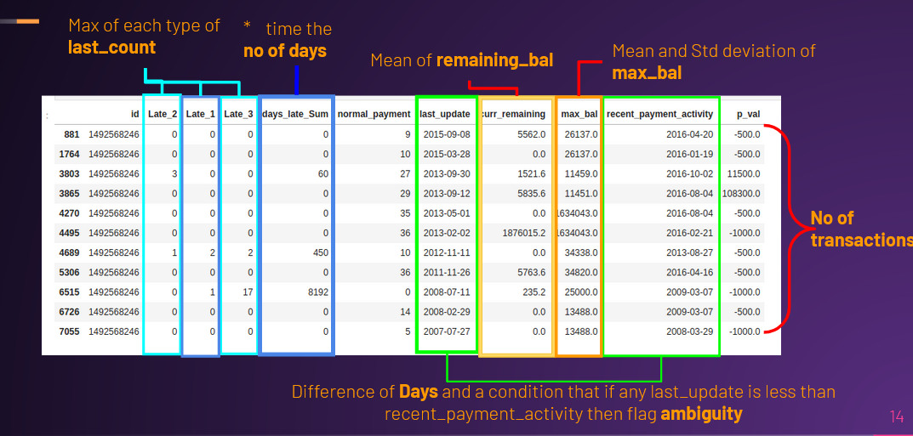

# Cassandra Udyam Defaulter Prediction
This repository contains the code and the explanation of our approach for building a Machine Learning model capable of predicting loan defaulters for a bank. This was the problem statement of the event Cassandra, a data science event of Udyam, the annual technical fest of the Electronics Engineering Society of IIT-BHU. With this we were able to secure the 2nd position.

### [Kaggle Competition](https://www.kaggle.com/c/cassandra-udyam21)

### [Approach In Detail](https://docs.google.com/presentation/d/1WixdK9DOvoyJOs2eGVcu-dKVSAS83WzqBok9wT54ugM/edit?usp=sharing)

### [Code](https://github.com/Terabyte17/Cassandra-Udyam-Defaulter-Prediction/blob/main/Cassandra%20Ctrl%20Shift%20Intelligence.ipynb)

## Our Approach in Brief
On extensive analysis of the data, we found several key attributes in it. This included temporal consistency in the <b>last_update</b> column, relations between <b>last_update</b> and <b>recent_payment_activity</b> columns and the imbalance of labels in the dataset to name a few. Data cleaning and feature engineering were applied before feature aggregation and merging of the 2 datasets. This was followed by splitting the dataset via [StratifiedKFold](https://scikit-learn.org/stable/modules/generated/sklearn.model_selection.StratifiedKFold.html) and applying [SMOTE](https://machinelearningmastery.com/smote-oversampling-for-imbalanced-classification/) to the training dataset. We used the [ROC-AUC-Score](https://scikit-learn.org/stable/modules/generated/sklearn.metrics.roc_auc_score.html) to validate our models and the [Optuna Framework](https://optuna.org/) for Hyperparameter Tuning.
We used an ensemble of a Decision Tree Classifier and an Adaboost Classifer as our model.

 

<em>Feature Aggregation</em> 

 

## Team Members ✨

<table>
   <td align="center">
      <a href="https://github.com/Terabyte17">
         
          
         
            <b>Yash Sahijwani</b>
         
      </a>
       
   </td>
   <td align="center">
      <a href="https://github.com/hex-plex">
         
          
         
            <b>Somnath Sendhil Kumar</b>
         
      </a>
       
   </td>
   <td align="center">
      <a href="https://github.com/Vikhyath08">
         
          
         
            <b>Vikhyath Venkatraman</b>
         
      </a>
       
   </td>
</table>

